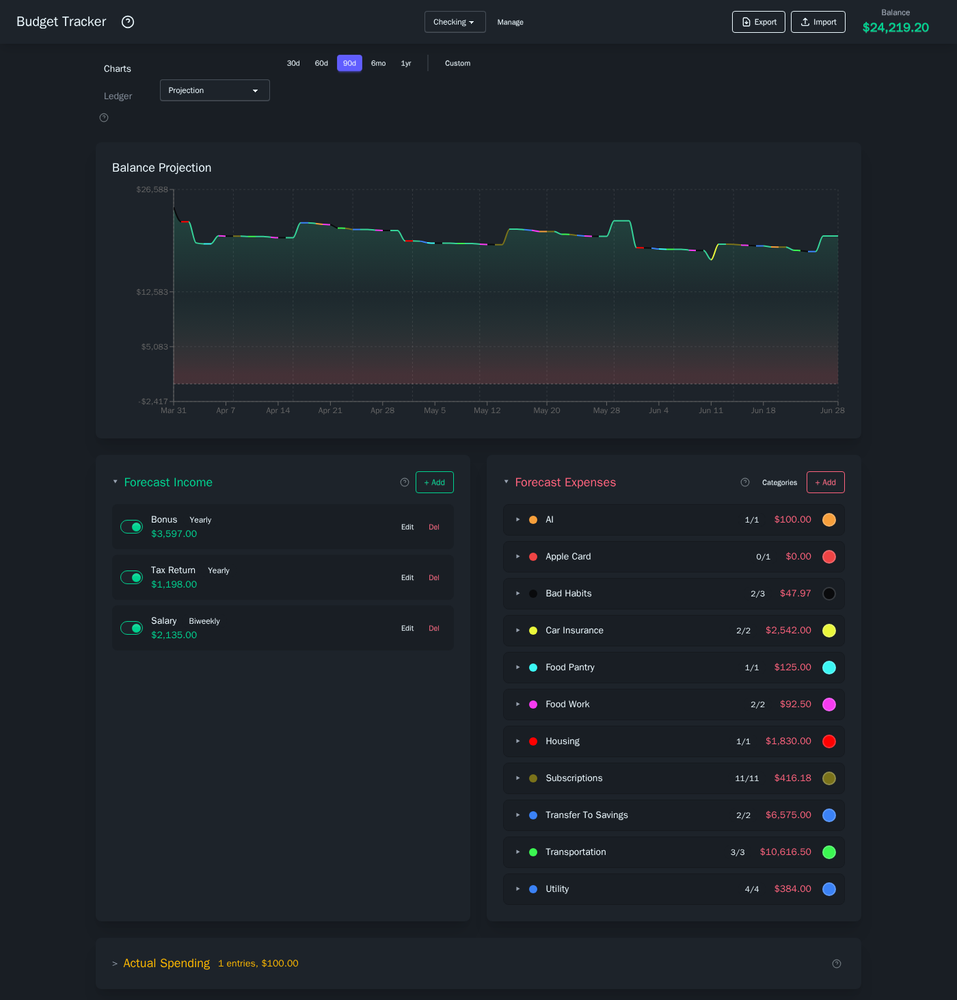

# Budget Tracker User Guide

Your complete guide to managing personal finances, forecasting your balance, and making confident decisions about your money.

Welcome! Whether you are setting up Budget Tracker for the first time or looking for a specific feature, this guide has you covered. Each section below walks you through a different part of the app with clear instructions, screenshots, and practical examples.

---

## Table of Contents

1. :rocket: **[Getting Started](getting-started.md)** -- First-time setup, setting your balance, and creating your first income or expense entry.

2. :bank: **[Accounts](accounts.md)** -- Creating, switching, renaming, and deleting accounts (checking, savings, etc.).

3. :heavy_dollar_sign: **[Income](income.md)** -- Adding, editing, and deleting income sources. Covers intervals, start dates, and the active/inactive toggle.

4. :credit_card: **[Expenses](expenses.md)** -- Adding, editing, and deleting expenses. Covers categories, end dates, and the active/inactive toggle.

5. :left_right_arrow: **[Transfers](transfers.md)** -- Setting up transfers between accounts and understanding how they appear on both sides.

6. :bar_chart: **[Charts](charts.md)** -- All five chart types explained: what they show, how to read them, and when to use each one.

7. :clipboard: **[Ledger](ledger.md)** -- The transaction table view, filters, search, and summary statistics.

8. :label: **[Categories](categories.md)** -- Creating, renaming, deleting, and color-coding expense categories.

9. :receipt: **[Actual Spending](actual-spending.md)** -- Recording real transactions, linking them to forecast expenses, and tracking actual vs. planned spending.

10. :page_facing_up: **[Spreadsheet Import/Export](spreadsheet.md)** -- Exporting your data to Excel, making changes, and importing updates back.

11. :bulb: **[Tips and Workflows](tips.md)** -- What-if analysis, date range selection, collapsible panels, and common workflows.

---

## Quick Overview

Budget Tracker helps you answer one question: **"What will my balance look like in the future?"**

You tell it your current balance, your income sources, and your planned expenses. It simulates each day forward and shows you a projected balance over time. You can:

- Track multiple accounts (checking, savings, etc.)
- Set up recurring income and expenses on various schedules
- Transfer money between accounts
- Organize expenses by category with custom colors
- View five different chart types for different perspectives on your finances
- Expand any chart to fullscreen with interactive zoom and range controls
- Browse a day-by-day ledger of projected transactions
- Record actual spending and link it to forecast expenses for real-vs-planned tracking
- Run what-if scenarios by temporarily toggling items on and off
- Export everything to a spreadsheet and import changes back

---

## Getting Help

If something is not covered in these guides, check the [Getting Started](getting-started.md) page first -- it walks through the most common setup steps. The [Tips and Workflows](tips.md) page covers practical scenarios and shortcuts.

> **Tip:** The app also has a built-in help panel -- click the help icon in the navigation bar to browse topics without leaving your dashboard.
